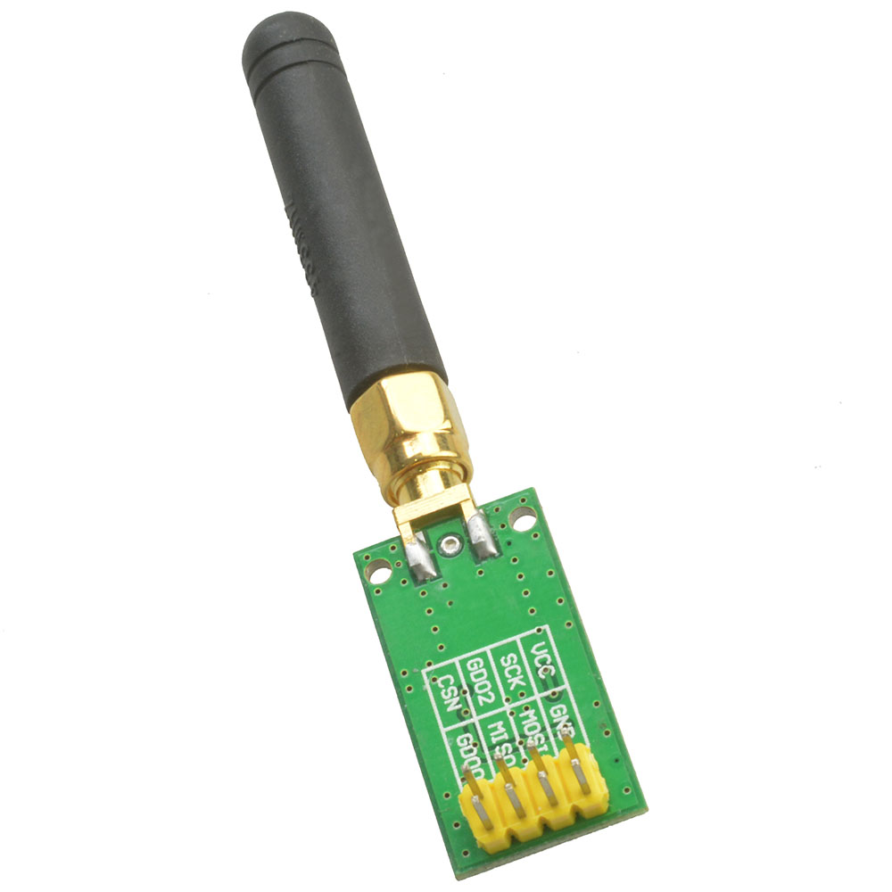

# IMPORTANT
--> make sure to copy both `tranceiver.yaml` and `cc1101.h` <--

# CC1101 support for ESPHome

# Usage
see tranceiver.yaml

# Raw signal visualizer
https://github.com/dbuezas/esphome-remote_receiver-oscilloscope
